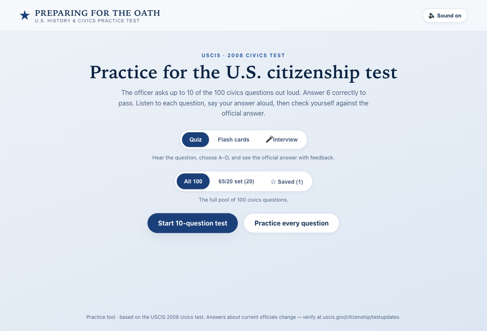
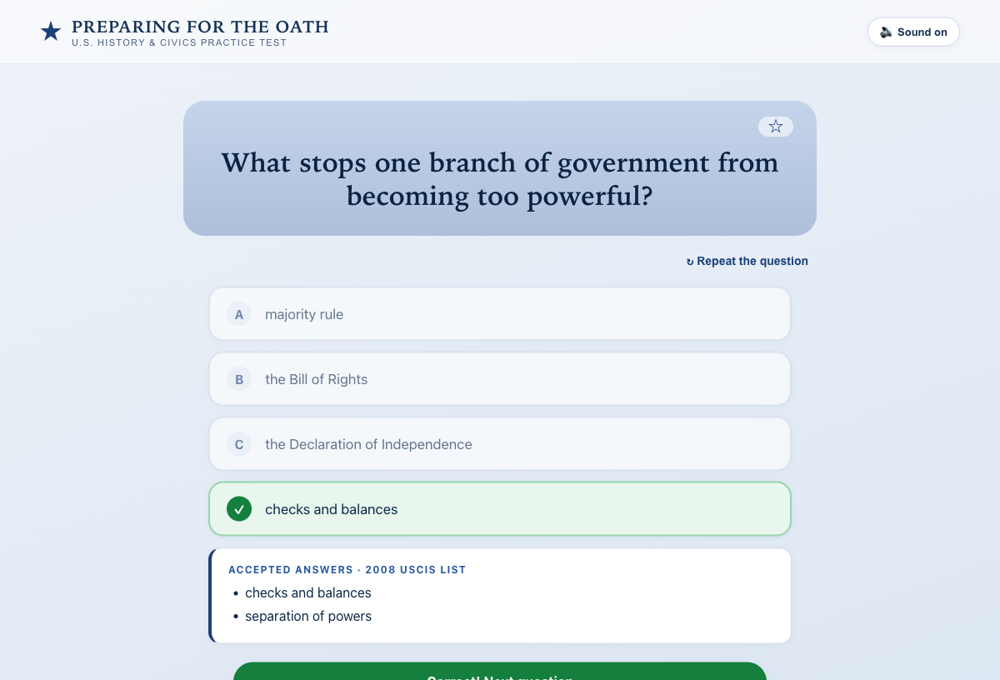
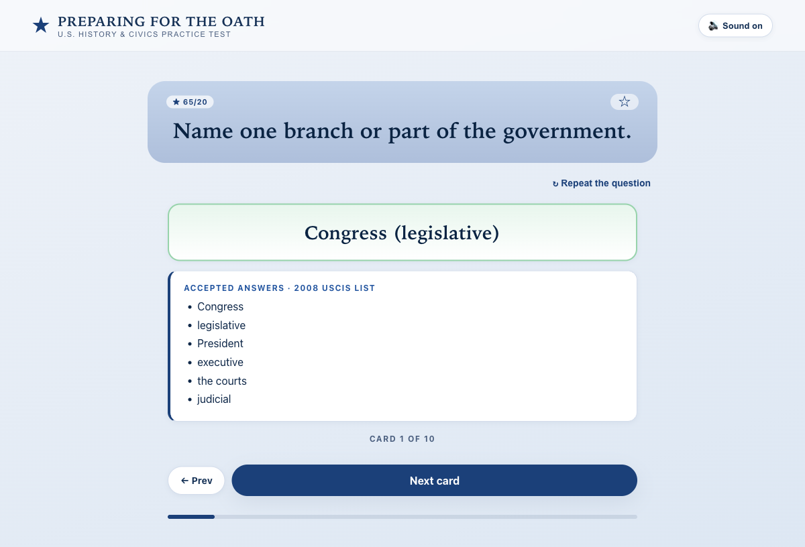
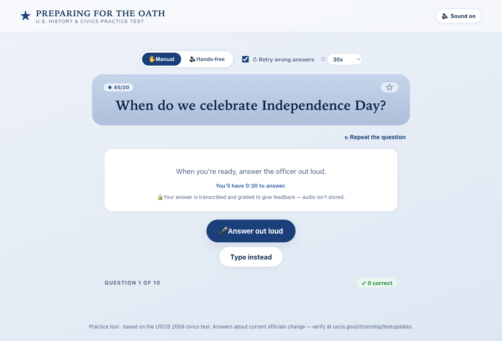

# Preparing for the Oath — U.S. Civics Test Trainer

A practice app for the **U.S. naturalization civics test (2008 version)**. It reads
each question aloud and lets you study in three ways — multiple-choice **Quiz**,
**Flash cards**, and a spoken **Interview** where an AI USCIS officer grades your
answers by voice and replies with spoken feedback.

All 100 official civics questions are included, with current officials' answers
(President, Vice President, Speaker, etc.) and Utah-specific answers (senators,
governor, capital) filled in from `uscis.gov/citizenship/testupdates`.

---

## Screenshots



| Quiz — multiple choice + feedback | Flash cards — flip to the answer |
|---|---|
|  |  |

**Interview** — speak your answers; Hands-free or Manual, an optional retry, and a
per-answer timer:



---

## Three study modes

| Mode | What it does |
|------|--------------|
| **Quiz** | Hear the question, pick **A–D**, get instant feedback and the official accepted answers. Mirrors the Smithsonian "Preparing for the Oath" flow. |
| **Flash cards** | Hear the question, recall the answer out loud, then **flip** the card to check it. No scoring — pure review, with Prev/Next navigation. |
| **Interview** | **Speak** your answer; an LLM grades it like a real officer (accepting paraphrases), tells you the verdict, and **speaks** feedback. Run it **Hands-free** (auto-listens, grades, and advances by itself) or **Manual** (tap to record/stop), with an optional **Retry wrong answers** mode. Real-exam scoring: 6 of 10 to pass. The closest practice to the actual oral test. |

### Shared features
- **Read-aloud audio** for every question (pre-generated, reliable — see below).
- **Mute / Repeat** controls.
- **Question sets:** All 100 · the 20-question **65/20** senior set · your **★ Saved** bookmarks.
- **Bookmarks** — star any question while studying and review just those later.
- **Shareable/resumable URL state** — the current mode, set, and question are encoded in the URL.
- **Test (10 questions, pass = 6/10)** or **Practice (whole set)** for each mode.

---

## Architecture

```
┌────────────────────────────┐         ┌─────────────────────────────────────┐
│  Frontend (React + Vite)   │         │  Interview backend (FastAPI, server/)│
│  • Quiz / Flash / Interview │  HTTPS  │  • POST /grade  → llm_core → Ollama   │
│  • pre-generated question   │ ──────► │  • POST /tts    → Piper (say fallback)│
│    audio (public/audio)     │         │  • POST /stt    → faster-whisper      │
│  • Web Speech / MediaRecorder│        │  • /health, rate limit, CORS          │
└────────────────────────────┘         └─────────────────────────────────────┘
        static host                       runs on your Mac (Cloudflare Tunnel
   (Vercel / Pages / Netlify)              exposes it publicly, all models local)
```

- **Quiz and Flash modes are fully static** — they need no backend.
- **Interview mode** calls the backend. If the backend is unreachable, Interview
  mode shows a friendly notice and the other two modes keep working.

---

## Project structure

```
civic_test/
├── src/
│   ├── App.tsx                  # orchestrates phases (start / quiz / results) + URL state
│   ├── data/questions.ts        # the 100 civics questions, answers, distractors, notes
│   ├── components/
│   │   ├── StartScreen.tsx       # format + question-set picker
│   │   ├── QuizScreen.tsx        # A/B/C/D quiz flow
│   │   ├── FlashScreen.tsx       # flip-card flow
│   │   ├── InterviewScreen.tsx   # spoken interview flow
│   │   ├── AnswerReveal.tsx      # shared accepted-answers panel
│   │   ├── ResultsScreen.tsx     # quiz results
│   │   ├── Header.tsx · ProgressDots.tsx
│   ├── hooks/
│   │   ├── useSpeech.ts           # plays pre-generated question audio (+ Web Speech fallback)
│   │   ├── useSpeechRecognition.ts# Web Speech API (speech-to-text in browser)
│   │   ├── useRecorder.ts         # MediaRecorder → server STT fallback
│   │   └── useBookmarks.ts        # saved questions (localStorage)
│   ├── api/interview.ts          # client for /grade, /tts, /stt
│   └── utils/ quiz.ts · url.ts · log.ts   # log.ts = timing/diagnostic logs
├── public/audio/                 # q-1.m4a … q-100.m4a (Piper voice)
├── scripts/generate-audio.mjs    # regenerates the question audio (Piper)
├── server/                       # Interview backend (FastAPI)
│   ├── app.py · grader.py · tts.py · stt.py · config.py · logutil.py
│   ├── voices/                    # Piper .onnx voice model
│   ├── README.md                  # backend setup
│   └── DEPLOY.md                  # public deployment runbook (Cloudflare Tunnel)
├── vite.config.ts                # dev server: LAN host, API proxy, opt-in HTTPS
└── .env.example                  # frontend VITE_INTERVIEW_API_URL (optional)
```

---

## Quick start

### 1. Frontend (Quiz + Flash work standalone)
```bash
npm install
npm run dev          # http://localhost:5173
```

### 2. Interview backend (for the Interview mode)
```bash
cd server
uv venv
uv pip install -r requirements.txt
uv pip install -e ../../llm_core     # shared LLM library
uv run uvicorn app:app --port 8088
```
Requirements: **Ollama** reachable with a grader model pulled. Configure the
backend in `server/.env` (copy from `.env.example`) — e.g. point `OLLAMA_HOST` at
a local or LAN Ollama and set `GRADER_MODEL`. Piper TTS and faster-whisper STT
install via `requirements.txt`; the Piper voice lives in `server/voices/`.

The frontend reaches the backend through the Vite **dev proxy** by default (same
origin), so no `VITE_INTERVIEW_API_URL` is needed locally. For **voice over the
network**, run `npm run dev:https` and open `https://<host>:5173` — voice needs a
secure origin (see [Browser support](#browser-support)).

---

## How each piece works

### Question audio (read-aloud)
Question audio is **pre-generated** into `public/audio/q-<id>.m4a` with **Piper**
(the same natural voice the officer uses for feedback), then played as static
files. This is deliberate — the browser's live Web Speech synthesis proved
unreliable, whereas static audio plays consistently everywhere. Regenerate after
editing questions:
```bash
npm run gen:audio          # Piper via the server venv → afconvert → m4a (falls back to macOS `say`)
```

### The questions data (`src/data/questions.ts`)
Each entry has the question, the **officially accepted answers**, and for
multiple-choice it adds three hand-written **distractors** (USCIS doesn't publish
wrong answers). Questions whose answers change (current officials) or are
state-specific carry a **note** with the current answer and a reminder to verify
at `uscis.gov/citizenship/testupdates`. "Name your U.S. Representative" stays a
spoken/look-it-up card because it depends on your exact address.

### Interview grading (the LLM)
The backend sends the question, accepted answers, and your transcribed answer to a
local LLM (via `llm_core` → Ollama, with `think:false` for speed) and asks for a
strict JSON verdict: `correct | partial | incorrect`, a one-sentence spoken
feedback, and the best answer to say. It accepts **paraphrases and synonyms** like
a real officer. If the LLM is down or replies with junk, a deterministic
string-match grader takes over so you always get a verdict.

### Interview mode — Manual, Hands-free, Retry & timer
- **Manual:** tap **🎤 Answer out loud**, speak, tap **Submit** (one tap to send —
  no separate review step), then **Next**.
- **Hands-free:** reads the question, **auto-listens**, detects when you stop
  talking (~2.2 s of silence), grades, **speaks the feedback**, and **advances by
  itself** — a self-running mock interview, with **Pause/Resume** anytime. (Needs
  Chrome/Edge speech recognition.)
- **Per-answer timer:** a configurable countdown (⏱ **30 s default, up to 2 min**)
  runs while you answer; the **Submit** button shows the time remaining and
  **auto-submits at 0**, so a recording never runs forever.
- **Retry wrong answers** (checkbox): on a miss, after the officer explains the
  answer you get **one more try**. Each question is tracked as **✓ correct** (first
  try), **↻ review** (correct only on retry), or **✕ missed**. The end screen shows
  a transcript with these markers and a **"Practice N you missed"** drill that
  re-runs everything you didn't get on the first try. The pass score counts
  first-try-correct only.

### Speech in / out
- **Speech-to-text:** Web Speech API in Chrome/Edge; **MediaRecorder → `/stt`
  (faster-whisper)** fallback for Safari/Firefox; typed input always available.
  You can **edit the transcript** before submitting, so a mis-hearing never costs
  you a question.
- **Text-to-speech (feedback):** **Piper** on the backend (macOS `say` fallback),
  returned as WAV and played in the browser. Text is always shown too.

---

## Backend API

Reached at a **relative path by default** (via the Vite dev proxy / a production
reverse proxy); set `VITE_INTERVIEW_API_URL` to call the backend directly instead.

| Method · Path | Body | Returns |
|---|---|---|
| `GET /health` | — | `{ ok, provider, model }` |
| `POST /grade` | `{ question, acceptedAnswers[], transcript, questionId? }` | `{ verdict, feedback, correctAnswer, heard, model, fallback }` |
| `POST /tts` | `{ text }` | `audio/wav` |
| `POST /stt` | multipart `file` (audio) | `{ text }` |

### Configuration (env, `server/.env.example`)
| Var | Default | Purpose |
|---|---|---|
| `OLLAMA_HOST` | `http://localhost:11434` | Ollama endpoint |
| `GRADER_PROVIDER` / `GRADER_MODEL` | `ollama` / `qwen3.5:9b` | grading LLM |
| `GRADE_TIMEOUT` / `GRADE_MAX_TOKENS` | `45` / `300` | grading limits |
| `ALLOWED_ORIGINS` | `localhost:5173` | CORS allow-list |
| `RATE_LIMIT_PER_MIN` | `30` | per-IP request cap |
| `TRUST_PROXY_HEADERS` | `0` | trust `X-Forwarded-For` for rate limits behind your own proxy |
| `GRADE_CONCURRENCY` / `TTS_CONCURRENCY` / `STT_CONCURRENCY` | `1` / `1` / `1` | local model/subprocess concurrency caps |
| `TTS_ENGINE` / `PIPER_VOICE` | `piper` / bundled | feedback voice |
| `WHISPER_MODEL` / `_DEVICE` / `_COMPUTE` | `base.en` / `cpu` / `int8` | STT model |

`server/.env` overrides these (e.g. point `OLLAMA_HOST`/`GRADER_MODEL` at a LAN
machine such as a Mac Studio). For thinking models like qwen3, the backend sends
`think:false` so the model answers immediately instead of burning the token budget.

> **Faster grading:** use a small non-reasoning model (e.g. `llama3.2:3b`) — civics
> grading doesn't need a large model. If the first grade after idle stalls ~20–30 s,
> the model was **cold-loaded** into VRAM; keep it resident with
> `OLLAMA_KEEP_ALIVE=2h` on the Ollama host.

---

## Deployment

The intended setup: static frontend on a free host + the API on your Mac exposed
via a **Cloudflare Tunnel** (all models stay local and free). Full runbook:
[`server/DEPLOY.md`](server/DEPLOY.md). Hardening already in place: per-IP rate
limiting, CORS lock, request/audio caps, injection-resistant grading, and graceful
degradation when the backend or TTS/STT is unavailable.

---

## Browser support
- **Quiz / Flash:** all modern browsers.
- **Interview speech-in:** best in **Chrome/Edge** (Web Speech API). Safari/Firefox
  use the server-side Whisper fallback; typing works anywhere.
- **Audio playback:** all modern browsers (m4a/AAC + WAV).

### ⚠️ Voice needs a secure origin (https or localhost)
Microphone + speech recognition are **only allowed on a secure context** — i.e.
`https://…` or `http://localhost`. Opening the app at a plain‑HTTP LAN address like
`http://macstudio.lan:5173` **disables voice** (you'll see a notice and can type
answers). To use voice over the network:

```bash
npm run dev:https      # serves https://<host>:5173 (self-signed cert — accept the warning once)
```

The dev server **proxies** the interview API (`/grade`, `/tts`, `/stt`, `/health`)
to the backend, so everything stays on one origin — no CORS and no mixed-content
block when served over HTTPS. Point the proxy at a non-default backend with
`API_PROXY=http://host:8088 npm run dev:https`. In production, serve over HTTPS and
set `VITE_INTERVIEW_API_URL` (or reverse-proxy the API under the same origin).

## Diagnostics (latency)
Timing logs show where a slow grade goes:
- **Browser console** (on in dev; in prod set `localStorage.ivDebug = "1"`): `[iv]`
  stage events and `[api]` round-trip timings, e.g. `[api] /grade done ms=2026`.
- **Server console** (`[civic]` lines): `grade llm=…ms` (pure model time),
  `/grade total=…ms` (endpoint), and `/tts` / `/stt` timings.

Compare them to localise lag: browser-RTT ≈ server-total → it's the model, not the
network; a large `llm=` (e.g. `~26000ms`) is a cold model load (see keep-alive tip).

## Privacy
Spoken answers are transcribed and graded only to produce feedback; **audio is not
stored**. With Web Speech, transcription happens via the browser's provider; the
Whisper fallback transcribes on your own backend.

## Tech stack
React 19 · TypeScript · Vite · Vitest + Playwright · FastAPI · llm_core/Ollama ·
Piper TTS · faster-whisper.

## Disclaimer
A study tool based on the USCIS 2008 civics test. Answers about current officials
change — always verify at **uscis.gov/citizenship/testupdates**. Not affiliated
with USCIS or the Smithsonian.
